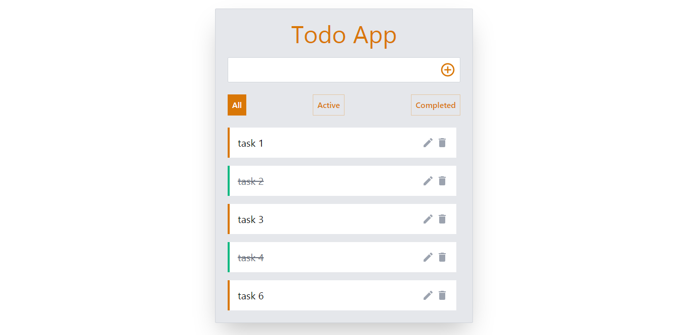

# Todo App



## Description

with this todo app the user can:

1. do all CRUD oprations (add new task,see all the tasks,edit a task,delete a task).
2. filter the tasks see completed,active or all tasks
3. the tasks are save on the local storage so the user can see the tasks after closing or refreashing the tab

## Getting Started

1. move to the project directory

2. run

```
npm install
```

3. run

```
npm start
```
